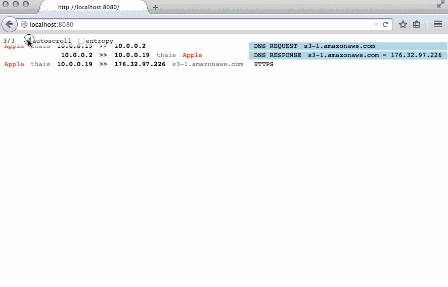

Sniffer.js
==========

This software intensely whitelists packets displayed. This permits easier
monitoring of traffic by someone less familiar with packet filtering (such as
actors on a stage). At the moment it is configured to only show outgoing packets
from 192.168. 10. and 172. networks. Elements such as Logins via unencrypted
POP / IMAP / HTTP-POST / HTTP-Auth shown. Images shown on mouse hover or
automatically opened in a new tab/window. This is basically a Wall-Of-Sheep
implementation for the theatrical stage.

cyphunk@deadhacker.com for use in the Anonymous-P theater production. Pull
requests and bug reports appreciated at any of:

*   <https://github.com/cyphunk/snifferjs>
*   <https://git.xiala.net/cyphunk/snifferjs>

Features
--------

*   Alt+Click on Source IP filters current list by IP
*   Alt+Click Application Protocol column filters by protocol
*   MDNS host resolution
*   Entropy Graph (protocol agnostic method to measure amount of crypto in use)
*   Map of sessions for destinations geographical (not shown in screencast)
*   Auto open image urls in new tab/window (not show)
*   Hover over image url to show
*   Click found HTTP url to open in new tab/window
*   POP/IMAP Logins shown but unlike screen cast text is same color as 
    background.
*   Login's via HTTP Post or HTTP Auth shown in light green

License
-------

License: Non-White-Heterosexual-Male

If you are not a white heterosexual male you are permitted to copy, sell and use
this work in any manner you choose without need to include any attribution you
do not see fit. You are asked as a courtesy to retain this license in any
derivatives but you are not required. If you are a white heterosexual male you
are provided the same permissions (reuse, modification, resale) but are
required to include this license in any documentation and any public facing
derivative. You are also required to include attribution to the original author
or to an author responsible for redistribution of a derivative.

<http://nonwhiteheterosexualmalelicense.org>

Install
-------

Requires node libpcap-dev installed on your system.

    git clone https://github.com/cyphunk/snifferjs.git
    cd snifferjs
    npm install

For resolving IP addresses to Geo Location download the Maxmind free dataset

    wget http://geolite.maxmind.com/download/geoip/database/GeoLiteCountry/GeoIP.dat.gz
    gzip -d GeoIP.dat.gz

Run
---

    node sniffer.js <interface> ""
    open http://localhost:8080

(last arg is optional pcap fitler. e.g "ip")

Sniffer.js has been tested with

    * node 4.2.6
    * npm 2.14.12
    * node-gyp 3.0.3

Others have [reported](https://github.com/node-pcap/node_pcap/issues/196)
``4.4.4`` ``5.7.0`` ``8.9.2`` may also work.

Configuration
-------------

    HTTP_ONLY_FIRST=true  Only the first HTTP packet will be shown. If a network
                          user accesses http://gessnerallee.ch only the GET for
                          the index.html will be shown, not subsequent image and
                          resource loads over HTTP. *_ONLY_FIRST applies in a
                          similar many for other protocols.

    FIRST_PER_IP=false    The *_ONLY_FIRST flags apply globally. This means if two
                          network users access HTTP sites at the same time only
                          the first will be shown.

    MAIL_ONLY_LOGIN=true  Only LOGIN requests for POP/IMAP are shown.

    ONLY_OUTGOING=true    Only show packets going out from 192.168 10. and 172.
                          networks. (AT THE MOMENT NOT AVAILABLE. ONLY_OUTGOING
                          is the default behavior)

Installation Alternatives
-------------------------

docker.io

    docker build -t snifferjs \
      https://raw.githubusercontent.com/cyphunk/snifferjs/master/Dockerfile

Older node v0.10.25 npm v1.3.24

    git reset --hard a68b74beef81d196969a0b9a06e25a2975f6b001
    rm -rf node_modules
    npm install

Etc
---

### Entropy Graphs

Currently disabled by default the code can display a graph of overall network
data entropy levels. For this one needs to install libdisorder

    git clone https://github.com/locasto/libdisorder.git
    cd libdisorder/code/src
    make
    # ON OSX:
    gcc -dynamiclib -flat_namespace "*.o" -o libdisorder.dylib
    cp libdisorder.dylib <snifferjsdir>
    # ON LINUX
    gcc -shared -o libdisorder.so -fPIC disorder.c
    cp libdisorder.so <snifferjsdir>

### Troubleshooting MDNS

To check that dig resolve for MDNS resolution:

    dig +noall +answer +time=1 -x <test_ip> -p 5353 @224.0.0.251
    dig +noall +answer +time=1 -x <test_ip> -p 5353 @<test_ip>

should return something like:

    <test_ip>.in-addr.arpa.	10	IN	PTR	thais.local.

``sniffer_cache.js`` uses this command and takes the last
part of the text when split on spaces.

### Error: libpcap.so.0.8: cannot open shared object

Recompile

### Dependency issues

Nodejs. Maybe try downgrading with the ``n`` package:

    npm install -g -n
    n 4.2.6
    rm -rf node_modules
    npm install